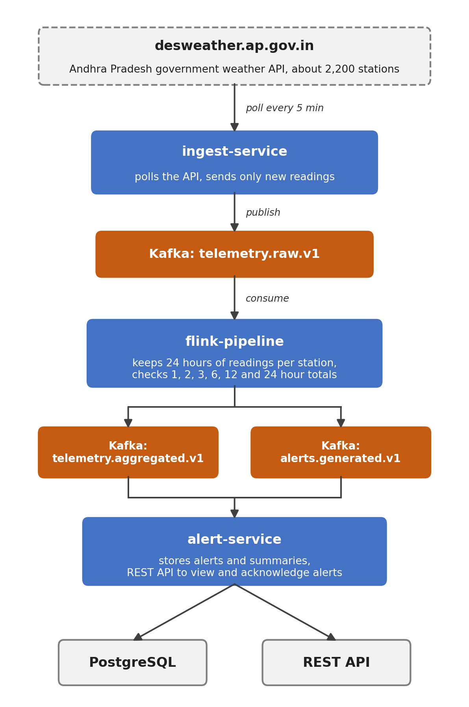

# Kafka + Flink Stream Processing

A rainfall alerting pipeline built with Apache Kafka and Apache Flink. It reads rainfall data from
the Andhra Pradesh government weather API, keeps a rolling 24 hour history for every station, and
raises an alert when the rainfall crosses set limits. The services run on Kubernetes and are built
and deployed with Jenkins and SonarQube.

Dissertation project for BITS Pilani WILP M.Tech (Cloud Computing),
*DevOps Automation with Scalable Services, Real-Time Monitoring, and Stream Processing*
(Course CCZG628T, BITS ID 2024MT03552).

---

## How it works



1. **ingest-service** polls `http://desweather.ap.gov.in/webservice/rest/json` every 5 minutes.
   One call returns about 2,200 stations.
2. The API gives a running total for the day, not the rain since the last reading. The service keeps
   the last total and update time for each station and works out the new rainfall:
   - update time not changed: the station is skipped
   - total went up: the difference is the new rainfall
   - total went down: the daily counter was reset, so the new total is used as it is
3. Only stations with new data are published to Kafka on `telemetry.raw.v1`, keyed by station id.
4. **flink-pipeline** reads the topic, groups readings by station and keeps the last 24 hours of each
   station in Flink state. On every reading it works out the 1, 2, 3, 6, 12 and 24 hour totals and
   checks them against the rainfall categories. If a limit is crossed it sends one alert (the
   highest one) to `alerts.generated.v1`. It also writes a one hour summary for every reading to
   `telemetry.aggregated.v1`.
5. **alert-service** reads both output topics, saves them in PostgreSQL and serves a REST API to
   list, filter and acknowledge alerts.

The API is polled on a schedule, but after that every reading is handled as a separate event, so
an alert comes out within seconds of the reading reaching Kafka. Flink checkpoints the station
histories and its Kafka position every 30 seconds, so a restart continues from where it stopped.

---

## Rainfall rules

The totals are compared with IMD style rainfall categories. A longer window needs more rain to reach
the same category:

| Category | 1 hour total | 24 hour total |
|---|---|---|
| Heavy rainfall | 16.1 mm and above | 64.6 mm and above |
| Very heavy rainfall | 30.1 mm and above | 115.7 mm and above |
| Extremely heavy rainfall | 50.0 mm and above | 204.5 mm and above |

Each window and category has an alert level. Short windows are mostly ignored, because an hour of
heavy rain alone is not a flood risk. The 6, 12 and 24 hour windows give caution, warning or alert,
stored as `WARNING`, `SEVERE` and `EXTREME`. The full tables for all six windows are in
[`RainfallAlertPolicy.java`](flink-pipeline/src/main/java/com/stream/processing/flink/rainfall/RainfallAlertPolicy.java).

---

## Modules

| Module | What it does | Tests |
|---|---|---|
| `common-model` | Shared event classes (`SensorReading`, `StationWindowAggregate`, `Alert`), topic names and JSON codec. | 31 |
| `ingest-service` | Spring Boot. Polls the weather API, works out new rainfall per station and publishes to Kafka. Also has a REST endpoint to post a reading by hand. | 38 |
| `flink-pipeline` | Flink job. Rolling 24 hour history per station, checks the six windows and emits alerts and summaries. | 88 |
| `alert-service` | Spring Boot and PostgreSQL. Stores alerts and summaries and serves the query API. | 109 |

`flink-pipeline` and `common-model` compile to Java 17, because Flink 1.20 has no Java 21 image.
The two Spring Boot services use Java 21.

### Kafka topics

| Topic | Written by | Read by | Contents |
|---|---|---|---|
| `telemetry.raw.v1` | ingest-service | flink-pipeline | New rainfall readings |
| `telemetry.dlq.v1` | flink-pipeline | kept for checking | Readings that failed validation |
| `telemetry.aggregated.v1` | flink-pipeline | alert-service | One summary per reading |
| `alerts.generated.v1` | flink-pipeline | alert-service | Alerts, only when a limit is crossed |

All topics have 3 partitions, matching the Flink job's parallelism.

Alert ids are built from the station, time window and severity. If Flink sends the same alert again
after a restart, alert-service updates the existing row instead of adding a new one.

---

## Running it locally

Prerequisites: Docker with Compose, JDK 21, Maven 3.9+.

```bash
docker compose -f deploy/docker/docker-compose.yml up -d --build
```

| Endpoint | URL |
|---|---|
| Flink web UI | http://localhost:8081 |
| Ingest service | http://localhost:8091 |
| Alert service | http://localhost:8092 |
| Kafka (from the host) | `localhost:29092` |
| PostgreSQL | `localhost:5433`, db/user/password `stream` |

The scraper starts polling the API on its own. To see an alert without waiting for the API to
update, post a test reading:

```bash
curl -X POST http://localhost:8091/api/v1/telemetry/readings \
  -H 'Content-Type: application/json' \
  -d '{"stationId":"TEST-STATION-01","sensorType":"RAINFALL","value":250.0}'

# a few seconds later: an EXTREME alert for the 24 hour window (250 mm is above 204.5 mm)
curl 'http://localhost:8092/api/v1/alerts?stationId=TEST-STATION-01'
curl 'http://localhost:8092/api/v1/alerts/summary'
```

For Kubernetes (minikube) see [`deploy/k8s/README.md`](deploy/k8s/README.md), and for the Jenkins
and SonarQube setup see [`deploy/cicd/README.md`](deploy/cicd/README.md).

### Configuration

| Property | Default | Meaning |
|---|---|---|
| `stream.ingest.desweather-url` | `http://desweather.ap.gov.in/webservice/rest/json` | Weather API address |
| `stream.ingest.desweather-poll-interval-ms` | `300000` | How often the API is polled |
| `stream.ingest.desweather-scrape-enabled` | `true` | Turns the scraper off, for example in tests |

### Build and test

```bash
mvn -B clean verify   # compiles, runs all 266 tests and writes JaCoCo coverage reports
```

---

## Known issues

- On the first poll the scraper has no earlier total for a station, so it sends the whole day's
  total as one reading. This can make the 6 and 12 hour totals look higher than they were.
- ingest-service runs as two pods on Kubernetes and each one polls the API with its own copy of the
  last totals. If one pod restarts on its own it can send full daily totals again. The plan is to
  run a single scraper and keep the last totals in PostgreSQL.
- The smoke test stage in the `Jenkinsfile` still calls the old `/simulate/burst` endpoint, which was
  removed. It has to be changed to post a test reading before the next pipeline run.

---

## Project status

| Phase | Status |
|---|---|
| Kafka and Flink rainfall pipeline on the real weather API | Done, tested on a local minikube cluster |
| Kubernetes deployment | Done, tested on a local minikube cluster |
| Jenkins pipeline with SonarQube quality gate | Set up, to be run again on the rainfall code |
| Prometheus, Grafana and HPA | Not started |
| Load testing and evaluation | Not started |
